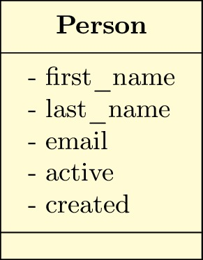
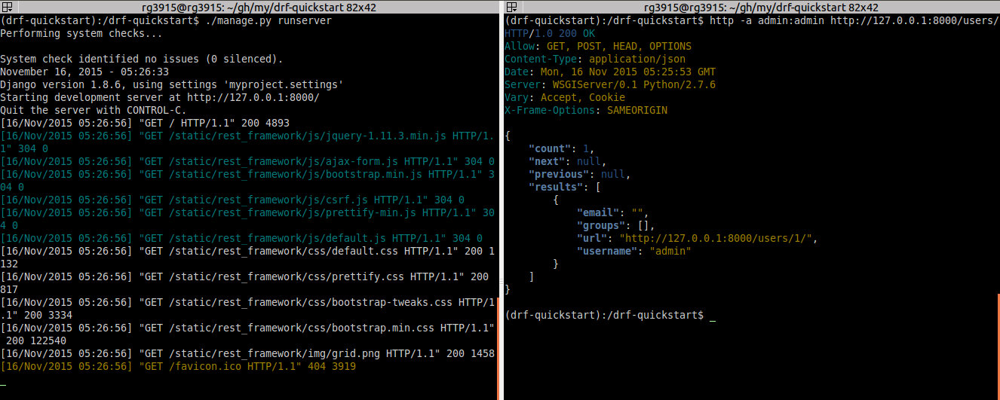
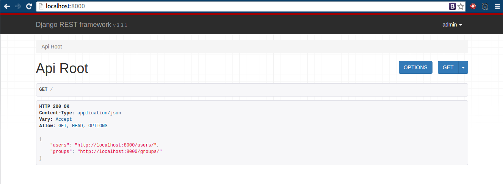

# Introdução ao Django Rest Framework Grupy-SP

Esta introdução é baseada em [Django Rest Framework Serialization][0], que foi baseado no meu GitHub [Django Rest Framework trainning and tests][1], que foi baseado no tutorial do [Hugo Brilhante][2] apresentado na [Python Brasil 11][3] (2015), que foi baseado na [documentação][4].


## O que é REST?

No [wikipedia][5] tem a resposta. ;)

Mas segundo [Diego Garcia][6], REST é um conjunto de princípios que definem como HTTP e URIs devem ser usados.

## Métodos

| Método HTTP | SQL equivalente | Finalidade da requisição      |
|-------------|-----------------|-------------------------------|
| POST        | INSERT          | Cria um novo recurso          |
| GET         | SELECT          | Lê um recurso existente       |
| PUT         | UPDATE          | Atualiza um recurso existente |
| DELETE      | DELETE          | Deleta um recurso existente   |


## Código de estado do HTTP

| Código | Sucesso/Falha | Mensagem                          |
|--------|---------------|-----------------------------------|
| 200    | sucesso       | OK                                |
| 201    | sucesso       | Created                           |
| 204    | sucesso       | No Content (deletado com sucesso) |
| 400    | falha         | Bad Request                       |
| 401    | falha         | Unauthorized                      |
| 403    | falha         | Forbidden                         |
| 404    | falha         | Not Found                         |
| 409    | falha         | Conflict                          |
| 500    | falha         | Internal Server Error             |


## Vamos aos códigos?

Para criar a API eu usei:

* Ambiente: `.venv`
* Projeto: `myproject`
* App: `core`
* Model: `Person`
* Fields: `first_name, last_name, email, active (boolean), created`




## Configurando um novo ambiente

```bash
$ python -m venv .venv
$ source .venv/bin/activate
$ mkdir drf-tutorial-grupy-sp; cd drf-tutorial-grupy-sp
$ pip install django==1.9.5 djangorestframework==3.3.3
$ pip freeze > requirements.txt
$ django-admin.py startproject myproject . # tem um ponto '.' aqui
$ cd myproject
$ python ../manage.py startapp core
$ cd ..
$ python manage.py migrate
$ python manage.py createsuperuser  --username='admin' --email=''
```

## Step-0 Projeto inicial

Abra o arquivo `settings.py` e em `INSTALLED_APPS` acrescente

```python
INSTALLED_APPS = [
    'rest_framework',
    'myproject.core',
]
```

# Explorando o User

## Step-1 Serializer

### Editando `serializers.py`


```bash
$ cd core
$ touch serializers.py
$ cd ..
```

Edite

```python
from django.contrib.auth.models import User, Group
from rest_framework import serializers


class UserSerializer(serializers.ModelSerializer):

    class Meta:
        model = User
        fields = ('url', 'username', 'email', 'groups')


class GroupSerializer(serializers.ModelSerializer):

    class Meta:
        model = Group
        fields = ('url', 'name')
```

### Editando `views.py`

```python
from django.contrib.auth.models import User, Group
from rest_framework import viewsets
from myproject.core.serializers import UserSerializer, GroupSerializer


class UserViewSet(viewsets.ModelViewSet):
    queryset = User.objects.all().order_by('-date_joined')
    serializer_class = UserSerializer


class GroupViewSet(viewsets.ModelViewSet):
    queryset = Group.objects.all()
    serializer_class = GroupSerializer
```


### Editando `urls.py`

```python
from django.conf.urls import url, include
from rest_framework import routers
from myproject.core import views

router = routers.DefaultRouter()
router.register(r'users', views.UserViewSet)
router.register(r'groups', views.GroupViewSet)

urlpatterns = [
    url(r'^', include(router.urls)),
    url(r'^api-auth/', include('rest_framework.urls', namespace='rest_framework'))
]
```

## Rodando a API

Abra duas abas no terminal, numa rode a aplicação.

```bash
$ python manage.py runserver
```



Na outra teste a API.

```bash
curl -H 'Accept: application/json; indent=4' -u admin:demodemo http://127.0.0.1:8000/users/
```

onde `admin:demodemo` equivale a `username:password`.

Experimente com [httpie][7]

```bash
http -a admin:demodemo http://127.0.0.1:8000/users/
```

> **Atenção**: se você receber erro 301, muito provavelmente é porque você esqueceu da barra `/` no final da url.



---

Leia a continuação deste post em [Django Rest Framework Serialization][0].


[0]: http://pythonclub.com.br/django-rest-framework-serialization.html
[1]: https://github.com/rg3915/drf
[2]: https://github.com/hugobrilhante/drf-tutorial-pybr11
[3]: http://pythonbrasil.github.io/pythonbrasil11-site/
[4]: http://www.django-rest-framework.org/tutorial/1-serialization/
[5]: https://pt.wikipedia.org/wiki/REST
[6]: https://github.com/rg3915/encontros/blob/master/2015/2015-07-7comm.md#boas-práticas-em-rest-apis---diego-garcia
[7]: https://github.com/jkbrzt/httpie#installation